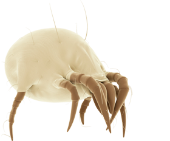
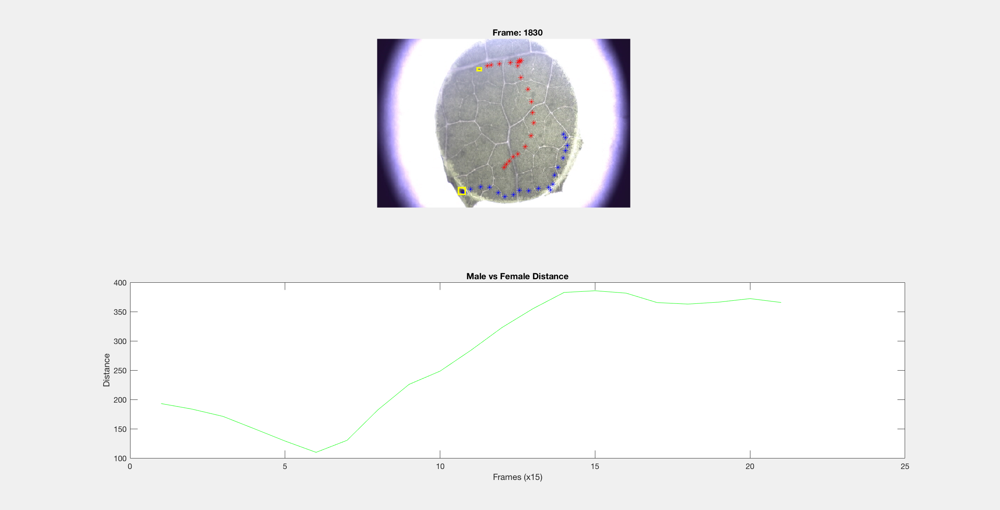

# Acari Project

## Introduction

This package is a Matlab implementation of a sexual selection and mating in acari MatLab Project. It is suggested the introduction of augmented reality in the video sequences, as well as meta-information capable do summarize the events in the sequence.

## Installation

1. Download the package by running: `git clone https://github.com/FMCalisto/acari-project.git`.

2. Run Matlab and navigate to package location as working directory, then run it.

3. Enjoy!

## License

Currently Released Under [MIT](https://github.com/FMCalisto/acari-project/blob/master/LICENSE)

## Contact

francisco.calisto@tecnico.ulisboa.pt

joao.zeferino@tecnico.ulisboa.pt

pedro.ricardo.silva@tecnico.ulisboa.pt

## Authors

[Pedro Silva](https://github.com/pmbrs)

[Francisco Maria Calisto](https://github.com/FMCalisto)

[João Pedro Zeferino](https://github.com/JPZef)
